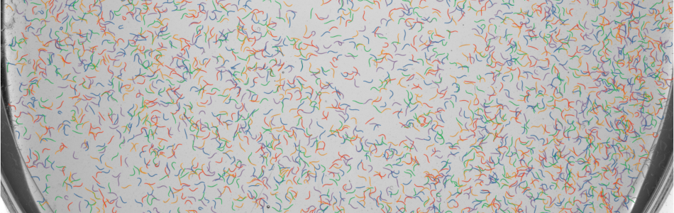

# de(ep)tangle
This repository contains the implementation of [Fast spline detection in high density microscopy data](https://arxiv.org/abs/2301.04460).


## Requirements
To run the code one must first install the dependencies.

```setup
pip install -r requirements.txt
```

If you need to use the model and the auxiliary functions outside this repository, you can install it from the root folder by
```install
pip install -e .
```

## Train
To train the model, there is a train script used for the model presented on the paper.
The possible arguments can be seen by using the help flag.
```train
python3 train.py --help
```

An example of a training run would be
```train
python3 train.py --batch_size=32 --eval_interval=10 --nworms=100,200 --save
```

## Usage
Example scripts such as detection and tracking can be found in the [examples folder](./examples)

We include a Dockerfile (cpu only), which can be run on linux using
```(sudo) sh docker_run.sh```


## Weights
The weights used on the paper can be downloaded from [here](https://sid.erda.dk/share_redirect/cEjIpG1yQl)
or by using the following commmand
```download
wget https://sid.erda.dk/share_redirect/cEjIpG1yQl -O weights.zip
```

